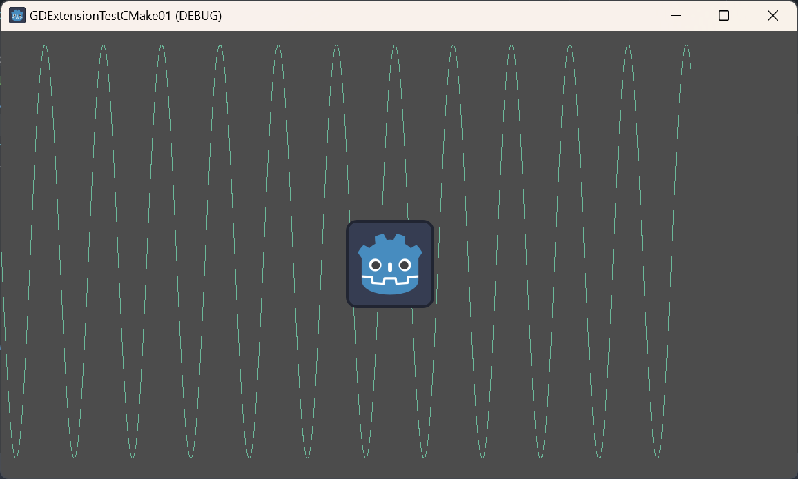

# GDJucy
 This is a personal project that aim is to link Godot with the JUCE audio engine. I am currently working on.

GodotにJUCEのオーディオエンジンを組み合わせて使いたいと思って試作中の個人的なプロジェクトです。完成品のライブラリではありません。

GDJucyはGodot4.3用のGDExtensionで、現在はJUCE 8.0.2の機能を利用することに成功しています。

# 現状の課題
しかし現状では、単純なサイン波を鳴らすだけでも、数秒から一分前後の間隔でクリックノイズ（ポップノイズ・プチノイズ？）が鳴るという問題があります。今のままでは実用性は低いです。

とはいえ一応目的は達成しているのと、一人でずっとノイズの原因追及等をやっているのは疲れた上に解決見込みがないので、まだ不完全ですが作業途中版を公開しました。

目的は情報共有と問題解決です。この問題の解決策や改善につながるアドバイスをもし頂けたら非常に助かります。

# ノイズ問題の確認方法
* exeフォルダの中にある実行ファイルを実行するとGodotアプリが起動し、うまく行けばサイン波の音が鳴ると思います。数十秒か数分聞いているとクリックノイズ（ポッという音など）が鳴ると思います。
* 上手くいかない場合はgdjucy/src/gdjucy.cppを自分のPC環境に応じて書き換え（オーディオデバイス選択やバッファサイズを指定）してビルドする必要があります。

## 今までに分かっていること
* オーディオデバイスタイプやバッファサイズを変えてもノイズには特に効果がない
* 処理の高速化（リリースビルドで最適化する等）はノイズの頻度の低減に効果があるようだが、完全にノイズをなくせるわけでは今のところない。
* スレッドの優先度を変えるのは効果が特になさそう
* Godot側のオーディオ出力デバイスは「Dummy」に設定している（実質無効化らしいが効果は感じられない）

## 今までに分かってないこと
* GodotとJUCEの連携に特有の問題なのかどうか（別プロジェクトへのJUCE組み込みでも起こるのか）
* Godot内部の動作。GDExtension、オーディオ周りの処理内容 (ソースコードの理解)
* JUCE内部の動作。ソースコードの理解

# 開発環境（別途インストールが必要なもの）
* Windows 10/11 [^1]
* Godot4.3 - https://godotengine.org/download/windows/ [^2]
* CMake3.30.3 - https://cmake.org/download/ [^3]
* Visual Studio Community 2022 https://visualstudio.microsoft.com/ja/vs/community/ [^4]
* もしかしたら他の何か

[^1]:クリーンなWindows10の場合は「Visual C++再頒布可能パッケージ」をインストールする必要があります（もしかしたら追加で.net Frameworkも必要かも）
[^2]:Godotエディタを使います。バージョンは完全一致させる必要があります
[^3]:このバージョンは適当に新しければよく、一致させなくていいです
[^4]:「C++によるデスクトップ開発」ワークロードを有効化する必要あり

# プロジェクト構成等について
* GDJucyはGDExtensionです。最終的な成果物としてはgdjucy.dllとgdjucy.gdextensionです。
* gdjucy/srcの中にソースコードがあります。
* godot_test_project/にテスト用のGodotプロジェクトがあります。Godotエディタで開いて実行できます。
* CMakeでCMakeLists.txtの設定に沿ってソースコードをコンパイルします。コンパイラはVisual Studio
* プロジェクトフォルダ直下でbuild.batを実行するとソースがコンパイルされ、build/gdjucy/Debug/gdjucy.dllが生成されます。godot_test_project/bin/以下にコピーすると、更新内容が実行プログラムに反映されます。

# 使用ライブラリ
* Godot Engine
* godot-cpp
* JUCE

# ライセンス
* AGPLv3となります。（JUCEの非商用ライセンスの制約から）
* プルリクエスト等で提供されたコード部分については、本プロジェクトへその著作権を譲渡したものとさせていただきます（CLA）。ご注意、ご了承の上お願いします。

# おもに参考にしたサイト
* Godot 4: GDExtension for C++ using CMake - That One Game Dev - https://thatonegamedev.com/cpp/cmake/godot-4-gdextension-for-c-using-cmake/
* JUCEでのオーディオデバイスの扱い方 #C++ - Qiita - https://qiita.com/lapis_tw/items/fff09ada48e0221fe506
* 【最新版 / 入門】JUCEを使ってVSTプラグインを作ろう！！！！【WebView UI】 | 東京工業大学デジタル創作同好会traP - https://trap.jp/post/2307/
* JUCE github - https://github.com/juce-framework/JUCE
* JUCE - JUCE Forum - https://forum.juce.com/